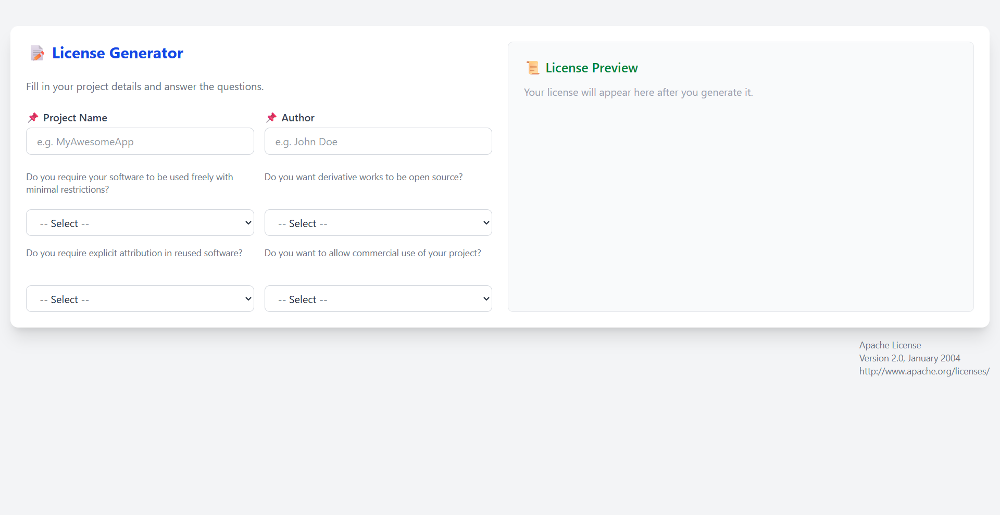
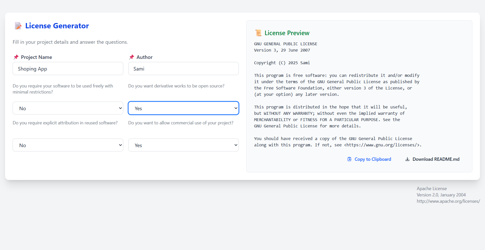
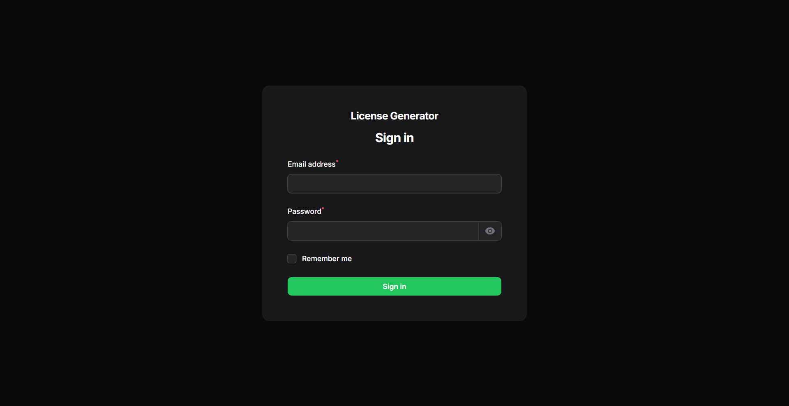
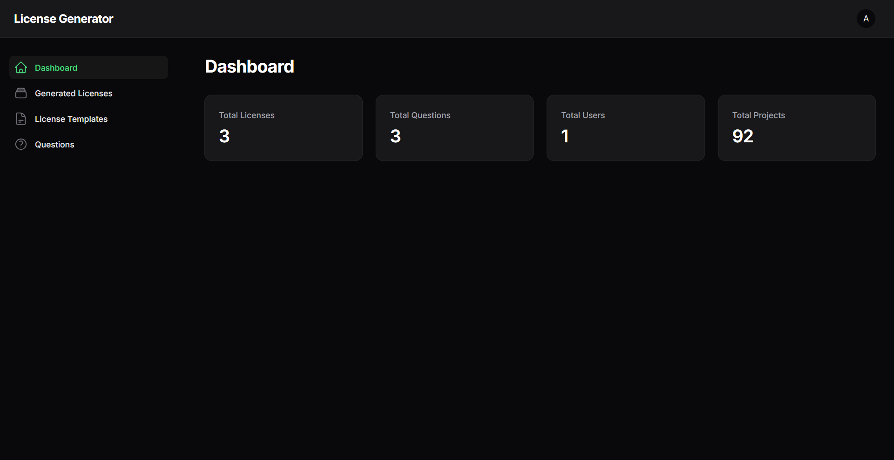
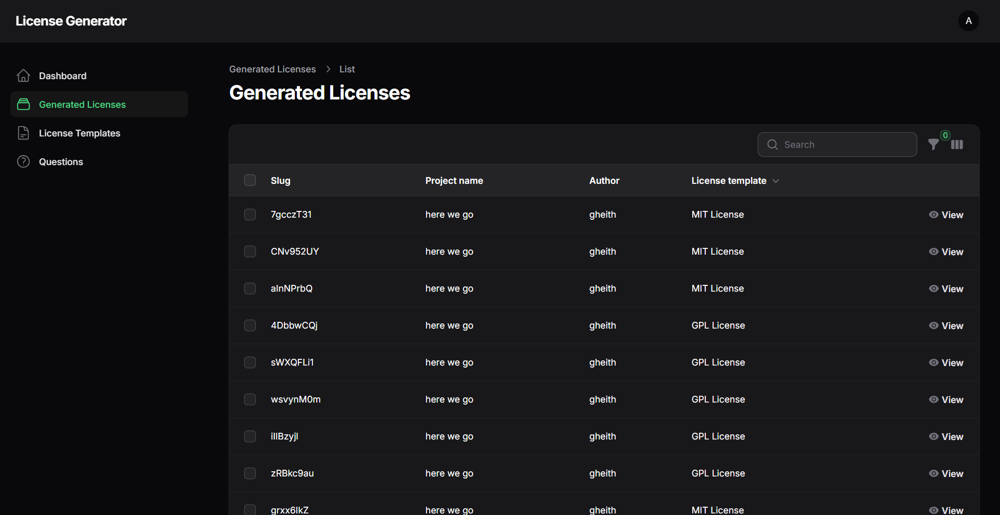
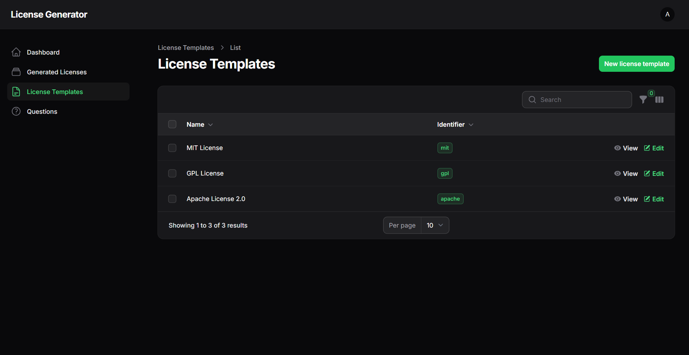
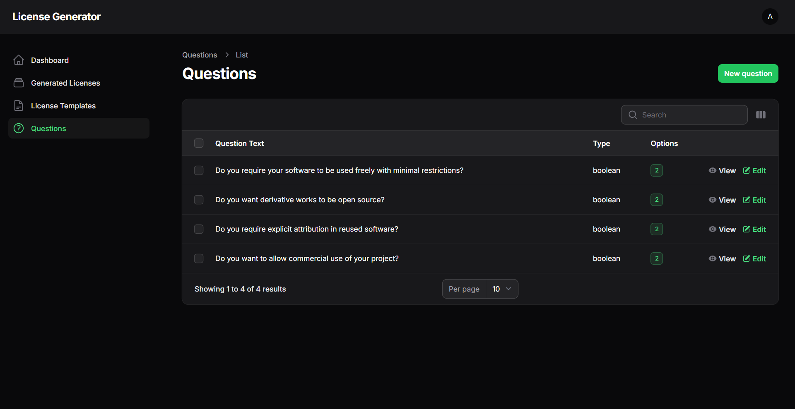
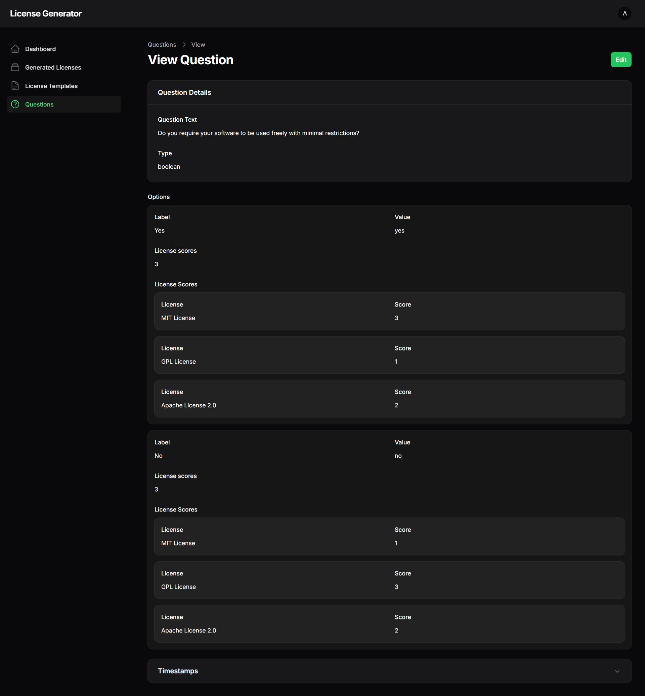
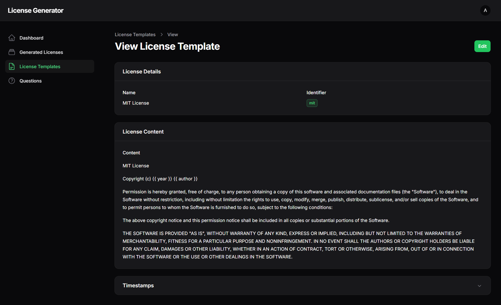

# Intelligent Open Source License Recommendation System

## Table of Contents

1. [Introduction](#introduction)
2. [Installation Guide](#installation-guide)
3. [Project Objectives](#project-objectives)
4. [System Architecture](#system-architecture)
5. [Methodology](#methodology)
6. [Results and Screenshots](#results-and-screenshots)
7. [Conclusion](#conclusion)

## Introduction

In the modern era of collaborative software development, open source licenses serve as vital instruments that define the terms under which software can be used, modified, and distributed. Licenses ensure legal protection, promote transparency, and foster community trust. Despite their importance, many developers, especially those new to open source, struggle to choose a license that aligns with their values and project goals.

This project was created to simplify the license selection process for open source developers. It allows users to answer a few structured questions, then automatically suggests the most suitable license based on their answers. This reduces confusion, saves time, and ensures legal clarity for developers and users alike.

## Installation Guide

### Prerequisites

Before installing the project, ensure you have the following prerequisites installed:

-   PHP 8.2 or higher
-   Composer (PHP package manager)
-   Node.js and npm
-   Git

### Installation Steps

1. Clone the repository:

```bash
git clone https://github.com/gheith3/open-license-generator.git
cd open-license-generator
```

2. Install PHP dependencies:

```bash
composer install
```

3. Create environment file:

```bash
cp .env.example .env
php artisan key:generate
```

4. Configure the database in .env file:

```env
DB_CONNECTION=sqlite
DB_DATABASE=/absolute/path/to/database.sqlite
```

5. Create the SQLite database:

```bash
touch database/database.sqlite
php artisan migrate
```

6. Seed the database with initial data:

```bash
php artisan db:seed
```

7. Install frontend dependencies:

```bash
npm install
npm run dev
```

8. Start the development server:

```bash
php artisan serve
```

After completing these steps, you can access the application at `http://localhost:8000`.

## Project Objectives

-   To simplify open source license selection through guided user input.
-   To educate users on key licensing concerns (e.g., attribution, commercial use).
-   To enable extensibility through a dynamic, database-driven architecture.
-   To build the application entirely with open source tools and technologies.

## System Architecture

### Technologies Used

This application is developed using a modern open source stack:

-   **Laravel 12**: Web framework for backend and routing.
-   **Livewire**: Enables dynamic and reactive components.
-   **Filament**: Admin panel and UI builder for Laravel.
-   **SQLite**: Lightweight database for simplicity and portability.
-   **PHP 8.2** and **Composer**: Programming language and dependency manager.
-   **PHPUnit**: Automated testing framework.

### Database Design

-   `LicenseTemplate`: Stores metadata and full text of licenses.
-   `Question`: Stores each decision-making prompt.
-   `Option`: Possible answers to each question.
-   `OptionLicenseScore`: Scores linking options to license recommendations.
-   `GeneratedLicense`: User-specific license results.

## Methodology

### Question Design

The system uses a small set of high-impact questions to evaluate user intent. Each question corresponds to a major licensing principle:

1. Should the software be usable with minimal restrictions?
2. Should derivative works be open sourced?
3. Should users give credit to the original author?
4. Should commercial use be allowed?

Each option (typically "Yes" or "No") is scored for every license template. This score reflects how well the option aligns with the goals of that license.

### Scoring Algorithm

The system uses a weighted scoring system:

| Question                    | MIT | GPL | Apache |
| --------------------------- | --- | --- | ------ |
| Minimal restrictions        | 3   | 1   | 2      |
| Open source for derivatives | 1   | 3   | 2      |
| Attribution required        | 2   | 3   | 2      |
| Allow commercial use        | 3   | 1   | 3      |

### System Flexibility and Extensibility

A unique feature of this system is its fully dynamic design. The system allows easy addition of new licenses and questions without modifying code:

-   New licenses are added via the `LicenseTemplate` table.
-   New questions and answer options are added via the `Question` and `Option` models.
-   `OptionLicenseScore` links every answer to a license score.

This approach makes it easy to:

-   Expand support for other license families (e.g., BSD, AGPL).
-   Modify or translate questions.
-   Implement more advanced logic in the future.

## Results and Screenshots

### System Interface


_Main Interface_


_License Selection Process_


_Question Interface_


_Admin Dashboard_


_License Management_


_Question Management_


_User Interface_


_Results Display_


_System Overview_

## Conclusion

The Intelligent Open Source License Recommendation System is an effective and extensible tool designed to help developers make informed licensing decisions. Built entirely with open technologies, it aligns well with the ethos of open source itself. By transforming a complex legal decision into a guided process, the system lowers barriers for developers around the world and promotes sustainable open source practices.

## Contributors

-   Zamo Rzgar Ahmed (2120246004)
-   Naser Al Musalhi (2120246005)
-   Gheith Alrawahi (2120246006)
-   Gheyath AL Mamoori (2120246020)
-   Mohamed Sidi (2120246048)
